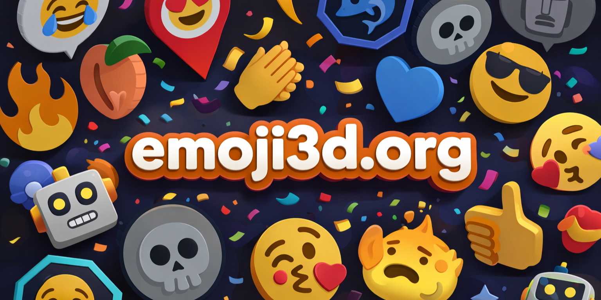
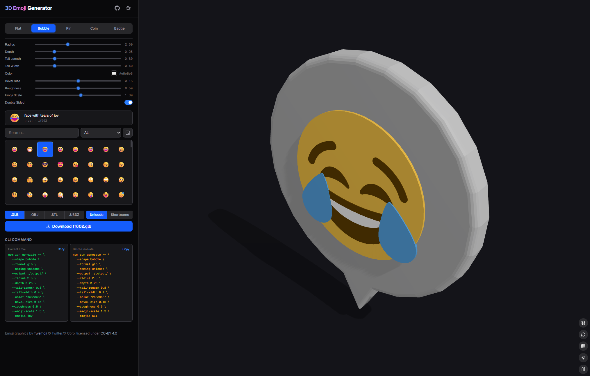

# 3D Emoji Generator

[](https://vercel.com)
[](LICENSE)
[](LICENSE-GRAPHICS)
[](https://github.com/jdecked/twemoji)


[](https://emoji3d.org)

Generate customizable 3D emoji assets from [Twemoji](https://github.com/jdecked/twemoji) SVGs. Choose from multiple shape presets (coins, speech bubbles), tweak every parameter, preview in real-time, and export as GLB, OBJ, STL, or USDZ — all in your browser. Includes a CLI for batch generation.

[](https://emoji3d.org)




### 1000 Rotating Emojis in Unreal

https://github.com/user-attachments/assets/49414e71-578b-40b5-b034-19634161dce5

## Download Pre-generated Assets

Pre-generated 4,009 emoji GLB asset packs are available for download in both **bubble** and **coin** shapes (~250 MB).

**[Download Pre-generated Assets on Google Drive](https://drive.google.com/drive/folders/1zSVN45hfUKDhuf6YsjPyC4E12omm_R5b?usp=drive_link)**

### Installation

```bash
git clone https://github.com/wangyz1999/3d-emoji-assets-generator.git
cd 3d-emoji-assets-generator
npm install
```

### Development

```bash
npm run dev
```

Open [http://localhost:3000](http://localhost:3000).


## CLI Usage

> [!IMPORTANT]
> The CLI renders models via a headless browser — **the dev server must be running before you generate anything.**
> You need two terminals open at the same time:
>
> ```bash
> # Terminal 1 — keep this running
> npm run dev
> ```
>
> ```bash
> # Terminal 2 — run your generate commands here
> npm run generate -- ...
> ```

### Generate a single emoji

```bash
npm run generate -- --shape bubble --emojis joy --format glb --output ./output/
```

`--emojis` accepts a shortname (`joy`), a Unicode code (`1f602`), a comma-separated mix of both, or `all`.

### Batch generate all emojis of default bubble shape

```bash
npm run generate -- --shape bubble --emojis all --format glb --output ./output/bubble/
```

### Speed up batch generation with concurrency

Use `--concurrency` to render multiple emojis in parallel (default: `4`):

```bash
npm run generate -- --shape bubble --emojis all --format glb --output ./output/bubble/ --concurrency 8
```

### Use Local Emoji

```bash
npm run generate -- --shape bubble --emojis all --format glb --output ./output/ --emoji-source local
```

For all available flags and per-shape style parameters, see the **[CLI Reference](docs/cli-reference.md)**.

> You can also view the full parameter list interactively in the web app — the **CLI Command** panel at the bottom of the left sidebar shows a live command that reflects your current settings.

## Export Formats

| Format   | Extension |
|----------|-----------|
| **GLB**  | `.glb`    |
| **OBJ**  | `.obj`    |
| **STL**  | `.stl`    |
| **USDZ** | `.usdz`   |


## Contributing

Contributions, feature requests, bug reports, and ideas are all welcome! Feel free to submit a Pull Request or open an issue.

## License

See the [LICENSE](LICENSE) and [LICENSE-GRAPHICS](LICENSE-GRAPHICS) files for full license texts.

Code licensed under the MIT License: <http://opensource.org/licenses/MIT>

Graphics licensed under CC-BY 4.0: <https://creativecommons.org/licenses/by/4.0/>

The emoji graphics used in generated assets are from [Twemoji](https://github.com/jdecked/twemoji) by Twitter/X Corp. If you distribute or publish generated assets, you must include attribution to Twemoji
